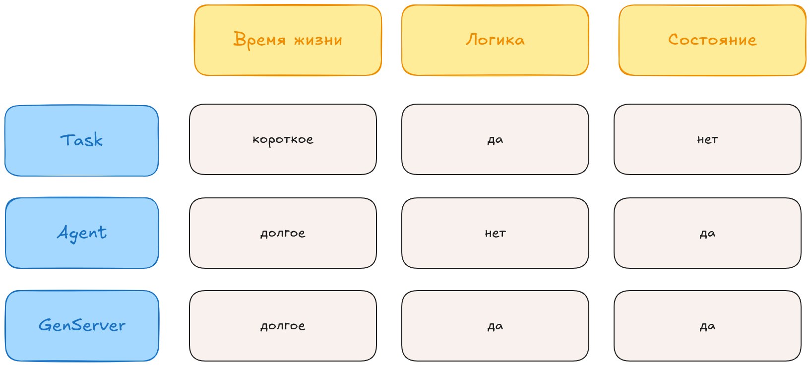

# Абстракции над процессами: Task, Agent, GenServer.

**spawn**, **send** и **receive** -- это низкий уровень работы с процессами, который в реальных проектах практически не используется. Это кирпичики, из которых построены высокоуровневые средства, более удобные и надежные. 

В этом уроке мы рассмотрим три таких средства: **Task**, **Agent** и **GenServer**.

Task и Agent -- относительно простые, но при этом мощные инструменты для задач многопоточности. 

GenServer -- краеугольный камень OTP-фреймворка, важнейшая основа любых проектов на Эликсире и Эрланге. Поэтому мы подробно остановимся на нем, изучим изнутри и снаружи.

Процессы бывают короткоживущие и долгоживущие. Короткоживущие процессы запускаются, чтобы сделать одну конкретную задачу и получить некий результат. После этого процесс больше не нужен. Они не обмениваются сообщениями, за исключением возврата конечного результата. В этом случае удобно использовать Task.

Долгоживущие процессы запускаются на старте системы, живут вместе с ней и завершаются вместе с ней. Они выполняют много задач, одинаковых или разных, и активно обмениваются сообщениями с другими процессами. Для них используют Agent или GenServer.

Task -- логика без состояния 
Agent -- состояние без логики
GenServer -- состояние и логика
gen_statem -- конечный автомат (сложные состояние и логика)



# Task

[Task](https://hexdocs.pm/elixir/1.12/Task.html) обычно используется, чтобы выполнить некую задачу асинхронно, не блокируя основную задачу.

Для примера, посчитаем количество слов в файле:

```elixir
file = "./10_01_task.md"

my_task = fn () ->
  {:ok, content} = File.read(file)
  String.split(content) |> length()
end

task_id = Task.async(my_task)
result = Task.await(task_id)
```

Те, кто имеет опыт с асинхронным кодов в любом языке, увидят здесь знакомый подход. Вызов `Task.async` не блокирует основной поток выполнения, а возвращает некий индентификатор, по которому можно будет получить результат позже. 

Вызов `Task.await` запрашивает результат. Если вычисление уже завершено, то результат вернется сразу. Иначе основной поток блокируется и ждет завершения вычисления. 

По умолчанию поток блокируется на 5 секунд, и если за это время результат не приходит, то генерируется исключение:

```elixir
sleep_6_sec = fn () ->
  Process.sleep(6000)
  :ok
end

task_id = Task.async(sleep_6_sec)
result = Task.await(task_id)
```

Можно явно указать время ожидания:

```elixir
task_id = Task.async(sleep_6_sec)
result = Task.await(task_id, 7000)
```

Если процесс внутри Task завершается аварийно, то при запросе `Task.await` так же генерируется исключение:

```elixir
crash = fn () ->
  exit(:normal)
end

task_id = Task.async(crash)
result = Task.await(task_id)
```


## MapReduce

Task хорошо подходит для реализации MapReduce. Идея тут простая -- сперва нужно запустить несколько Task, а затем запросить результат у каждого из них.

Для этого есть удобный АПИ [async_stream/3](https://hexdocs.pm/elixir/1.12/Task.html#async_stream/3).

async_stream принимает список и функцию. Для каждого элемента списка запускается Task, который вызывает данную функцию, и передает ей аргументом свой элемент списка. Это своего рода многопоточный [Enum.map/2](https://hexdocs.pm/elixir/1.12/Enum.html#map/2).

async_stream возвращает [Stream](https://hexdocs.pm/elixir/1.12/Stream.html), то есть ленивую коллекцию. Мы уже умеем работать с такими коллециями. 

```elixir
files = ["./11_01_task.md", "./11_02_agent.md", "./11_03_create_gen_server.md"]

my_task = fn (file) ->
  {:ok, content} = File.read(file)
  String.split(content) |> length()
end
```

Фаза map уже готова. Нам еще не хватает фазы reduce, чтобы получить полноценный MapReduce.

TODO подробнее про `Task.async_stream/3`
https://hexdocs.pm/elixir/1.13/Task.html#async_stream/3

Task.async_stream скрывает композицию двух монад: Future и Result

```elixir
Future<Result<int>>
```

```elixir-iex
iex(1)> list = [1, 2, 3, 4]
[1, 2, 3, 4]
iex(2)> stream = Task.async_stream(list, fn(i) -> i + 10 end)
#Function<3.31790546/2 in Task.build_stream/3>
iex(3)> Enum.reduce(stream, 0, fn({:ok, val}, acc) -> acc + val end)
50
```

Применим `async_stream` к дереву `processes_tree`. Если текущий элемент дерева это mapper, то внутри Task запускается `map_reduce({:mapper, file})`. А если текущий элемент это reducer, то внутри Task запускается `map_reduce({:reducer, children})`.

```elixir-iex
iex(18)> c "lib/map_reduce_task.exs"
[Lesson_11.Map_Reduce]
iex(19)> alias Lesson_11.Map_Reduce, as: MP
iex(20)> MP.start
do_reduce [reducer: [mapper: "./11_01_task.md", mapper: "./11_02_agent.md"], reducer: [mapper: "./11_03_create_gen_server.md", mapper: "./11_04_gen_server_module.md"]]
do_reduce [mapper: "./11_01_task.md", mapper: "./11_02_agent.md"]
do_reduce [mapper: "./11_03_create_gen_server.md", mapper: "./11_04_gen_server_module.md"]
do_map file './11_01_task.md'
do_map file './11_03_create_gen_server.md'
do_map file './11_02_agent.md'
do_map file './11_04_gen_server_module.md'
mapper result 477
mapper result 331
mapper result 963
reducer result 808
mapper result 1997
reducer result 2960
reducer result 3768
3768
```

Решение получилось очень простое и лаконичное в сравнении с тем, что мы делали с помощью spawn и receive.
